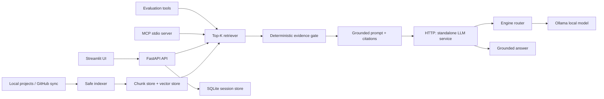

# Context Assist

Context Assist is a local, repository-aware developer assistant. It indexes selected project files, retrieves relevant code and documentation, applies deterministic evidence gating, and asks a local model to answer from that evidence with source citations. It supports project exploration and developer assistance; results depend on the indexed repository and local model.

## What it does

- Discovers local workspaces and safely indexes supported repository content.
- Maintains chunk and vector artifacts with fingerprints for incremental indexing.
- Retrieves top-ranked chunks, gates weak evidence, produces grounded answers, and returns source citations.
- Preserves selected exact repository facts when they are present in accepted evidence.
- Provides a FastAPI API, Streamlit repository/model selector and chat UI, persistent SQLite sessions, and MCP tools.
- Supports safe repository refresh, GitHub-backed risks and milestones when credentials are supplied, and deterministic/live evaluation.

## Architecture



RAG, inference, and MCP remain separate. `rag/` calls the standalone LLM service over HTTP; it does not execute Ollama. The Streamlit UI calls the project API and does not execute Ollama.

## Project structure

```text
app.py             FastAPI API, indexing, sessions, and operational endpoints
app_processing/    loading, filtering, chunking, embeddings
github/            repository sync and GitHub helpers
rag/               retrieval, evidence gating, grounded-answer assembly
vector_store/      FAISS/BM25-backed repository vector storage
llm_service/       standalone inference API, engine router, Ollama engine
ui/                Streamlit client
evaluation/        versioned synthetic benchmark and diagnostics
mcp/               JSON-RPC MCP server
utils/             session store and shared helpers
tests/             regression suite
audit/             project audit scripts and criteria
```

## Windows setup

Requirements: Python 3.10+, a locally running Ollama installation for inference, and the packages in `requirements.txt`.

```powershell
python -m venv venv
.\venv\Scripts\Activate.ps1
pip install -r requirements.txt
ollama serve
```

Install the recommended validated model in another terminal if it is not already present:

```powershell
ollama pull llama3.2:1b
```

Create an ignored `.env` only when configuration is needed. Never commit it. The release recommendation is `llama3.2:1b`; the source-code fallback when no value is set is `qwen2.5:7b`.

```dotenv
# Optional local inference selection
LLM_DEFAULT_MODEL=llama3.2:1b
# LLM_FALLBACK_MODEL=llama3.2:1b

# Optional API and RAG settings
# LLM_API_URL=http://127.0.0.1:9001/generate
# LLM_TIMEOUT_SECONDS=120
# LLM_CLIENT_TIMEOUT_SECONDS=270
# RAG_TOP_K=5
# RAG_MAX_CONTEXT_CHARS=3000
# RAG_MAX_SOURCES=3
# RAG_EVIDENCE_MIN_SCORE=0.25
# RAG_EVIDENCE_STRONG_SCORE=0.35
# RAG_EVIDENCE_RELATIVE_SCORE=0.72
# CHAT_HISTORY_TURNS=10
# SESSION_DB_PATH=runtime/sessions.sqlite3

# Optional GitHub integration; local RAG does not require this.
# GITHUB_TOKEN=...
```

`LLM_FALLBACK_MODEL` is considered only for the configured service default after an unavailable-model or memory failure. A request with an explicit model never falls back. `CONTEXT_ASSIST_API_URL` optionally changes the Streamlit API target.

## Start the services

Start these in order from the repository root:

```powershell
# Terminal 1: Ollama backend (default port 11434)
ollama serve

# Terminal 2: standalone inference service (port 9001)
.\venv\Scripts\python.exe -m uvicorn llm_service.server:app --host 127.0.0.1 --port 9001

# Terminal 3: Context Assist API (port 8000)
.\venv\Scripts\python.exe -m uvicorn app:app --host 127.0.0.1 --port 8000 --lifespan off

# Terminal 4: Streamlit UI (default port 8501)
.\venv\Scripts\python.exe -m streamlit run ui/streamlit_app.py
```

`--lifespan off` prevents automatic workspace indexing; use `POST /index` or the UI to index explicitly. The default ports are Ollama `11434`, LLM service `9001`, API `8000`, and Streamlit `8501`.

## Health, readiness, and models

- `GET /health` is API liveness and does not wait on dependencies.
- `GET /ready` reports bounded dependency state for SQLite, vector storage, the LLM service, and GitHub configuration.
- `GET /config` exposes safe operational settings only.
- `GET /models` proxies locally available models from the standalone LLM service.
- `GET /repositories` reports known repository/index state; `POST /repositories/{repo_id}/reindex` refreshes a selected repository.

The LLM service exposes `GET /health`, `GET /models`, and `POST /generate`. It is `degraded` when it is alive but Ollama is unavailable. If the LLM service is unavailable, indexing, repository browsing, and sessions remain usable while inference returns its normal error status. Missing or invalid GitHub credentials block only GitHub-dependent functionality; local repository RAG does not require a token.

Each API response has an `X-Request-ID`; clients may supply one. Logs record operational metadata such as request ID, action, status, and timing without logging prompts, repository chunks, credentials, or upstream error bodies. See [OPERATIONS.md](OPERATIONS.md) for diagnostics and recovery details.

## Evaluation

The version-controlled 15-case synthetic dataset checks retrieval, citations, refusal behavior, grounding constraints, and latency. It is useful for regression and local comparison, not universal production-accuracy evidence.

```powershell
# Deterministic pipeline validation; no live model required
.\venv\Scripts\python.exe -m evaluation.runner --mode deterministic

# One live-model run
.\venv\Scripts\python.exe -m evaluation.runner --mode live --model llama3.2:1b

# Same configuration across installed models
.\venv\Scripts\python.exe -m evaluation.runner --mode live --models llama3.2:1b,mistral:latest

# Service/backend/model preflight and one warm-up
.\venv\Scripts\python.exe -m evaluation.diagnostics --model llama3.2:1b
```

Latest valid local live result for `llama3.2:1b`: 15/15 completed, Hit@5 `1.0000`, citation precision `0.8333`, unsupported-refusal accuracy `1.0000`, median inference latency about `834.6 ms`, and one lexical grounding mismatch. `mistral:latest` returned HTTP 500 during local warm-up after about 16.7 seconds, so it has no valid quality ranking. `llama3.2:1b` remains the validated local release recommendation.

See [evaluation/README.md](evaluation/README.md) for metric definitions and report behavior. Run the regression suite with:

```powershell
.\venv\Scripts\python.exe -X utf8 -m unittest discover -s tests -v
```

## Limitations

- Retrieval depends on the files successfully indexed from a repository.
- Evidence gating reduces unsupported answers; it cannot mathematically guarantee no hallucinations.
- Small local models can paraphrase or omit literals despite exact-fact preservation.
- The benchmark is synthetic and small, and latency depends on installed models and local hardware.
- GitHub features require valid credentials and repository access.
- Citations and line ranges depend on the metadata available at indexing time.

Generated indexes, session databases, reports, logs, virtual environments, and `.env` files are ignored by Git. [rag/PIPELINE.md](rag/PIPELINE.md) documents the response and evidence flow, and [OPERATIONS.md](OPERATIONS.md) covers running services.\n